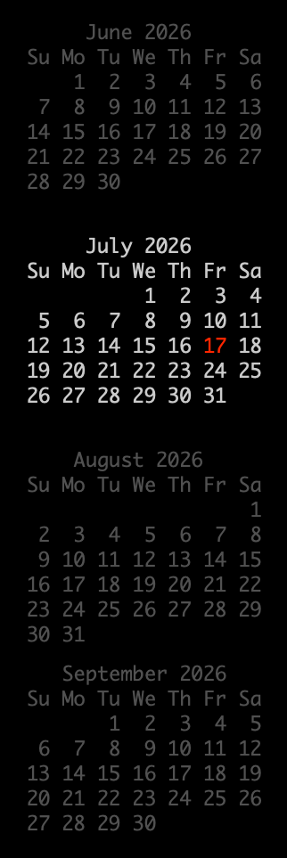

# DeskCal

A macOS menubar app that draws ASCII-style month calendars directly on your
desktop — just above the wallpaper, below your windows. The text is completely
non-interactive: it cannot be selected or clicked, and mouse events pass
straight through to the desktop.

Past and future months render in a configurable "inactive" color (grey by
default), the current month in an "active" color (white), and today's date in
a highlight color (red).



## Features

- Lives in the menubar (no Dock icon)
- A world clock to the right of the current month, one line per time zone
  (e.g. `Denver 19:51 Saturday, July 18`), automatically ordered by UTC offset
- Configurable via **Preferences…** in the menubar menu:
  - Font (any fixed-pitch font installed) and font size
  - Active month, inactive month, and today font colors
  - Number of months prior and following the current month (0–12 each)
  - Screen corner anchor (top/bottom × left/right) plus X/Y pixel offsets
  - Time zones shown in the world clock — add or remove any number; defaults
    to Denver, Detroit, Paris, and Seoul
  - Launch at login
- Redraws automatically at midnight, on wake from sleep, and when displays
  change; also every 30 seconds while at least one time zone is configured,
  to keep the world clock current
- Universal binary (Apple Silicon + Intel), macOS 12 Monterey or later

## Install

Download `DeskCal-<version>.dmg` from the
[Releases](../../releases) page, open it, and drag **DeskCal** to
**Applications**. Releases are signed with a Developer ID certificate and
notarized by Apple, so they open without Gatekeeper warnings.

## Build from source

Requires Xcode 13.2+ (Swift 5.5) on macOS 12 or later.

```sh
swift test                                        # unit tests
swift build -c release --arch arm64 --arch x86_64 # universal binary
scripts/make-app.sh 1.0.0                         # -> dist/DeskCal.app
scripts/make-dmg.sh 1.0.0                         # -> dist/DeskCal-1.0.0.dmg
open dist/DeskCal.app
```

On an older toolchain you can also build single-arch with plain
`swift build -c release`; `make-app.sh` picks up either output location.

## CI, signing, and releases

`.github/workflows/build.yml` runs on every push to `main`, every pull
request, and every `v*` tag. It:

1. Runs the unit tests.
2. Builds a universal (arm64 + x86_64) release binary and assembles
   `DeskCal.app`.
3. Signs the app with your **Developer ID Application** certificate using the
   hardened runtime, packages a DMG, signs it, submits it to Apple for
   notarization, and staples the tickets.
4. Uploads the DMG and a zip of the app as build artifacts.
5. On `v*` tags, attaches them to a GitHub Release.

If the signing secrets are absent (e.g. pull requests from forks), the
workflow still builds, tests, and uploads an **unsigned** app so CI stays
green.

### Required GitHub secrets

| Secret | Contents |
| --- | --- |
| `MACOS_CERT_P12` | Base64 of your Developer ID Application certificate + private key (`.p12`) |
| `MACOS_CERT_PASSWORD` | Password protecting the `.p12` |
| `KEYCHAIN_PASSWORD` | Any random string; protects the temporary CI keychain |
| `APPLE_ID` | Apple ID email of the developer account |
| `APPLE_TEAM_ID` | 10-character team ID (visible at developer.apple.com → Membership) |
| `APPLE_APP_SPECIFIC_PASSWORD` | App-specific password for notarization, created at appleid.apple.com |

To produce `MACOS_CERT_P12`: in Keychain Access, export your
"Developer ID Application: …" certificate (with its private key) as a `.p12`,
then run:

```sh
base64 -i DeveloperID.p12 | pbcopy
```

and paste the result into the secret.

### Cutting a release

```sh
git tag v1.0.0
git push origin v1.0.0
```

The workflow builds, signs, notarizes, and attaches
`DeskCal-1.0.0.dmg` / `DeskCal-1.0.0.zip` to the release.

## License

BSD 3-Clause. See [LICENSE](LICENSE).
